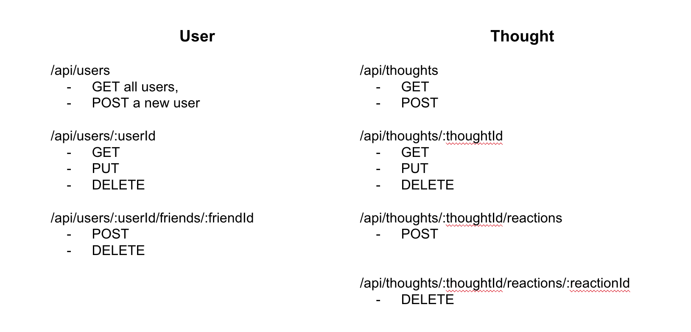

# Social-Media-Backend


## Table Of Contents
* [Description](#description)
* [Video](#video)
* [Installation](#installation)
* [Usage](#usage)
* [Tests](#tests)
* [Code Snippets](#code-snippets)
* [Technologies](#technologies)
* [License](#license)
* [Author Links](#author-links)

## Description
This application is a backend to manage a database for a Social Media application. The database stores users, their thoughts, and reactions to the thoughts as MongoDB collections. A front end client can send POST, GET, PUT and DELETE HTTP requests to the Express server through RESTful API routes to access these collections. The server uses Mongoose to perform the CRUD operations to process the requests and returns responses. 

## Video

These videos walk through the application installation and the interaction between the Insomnia client and the server:

Setup / Installation:\
[Install npm, seeds, and run server](https://drive.google.com/file/d/1jAH7q4i5CQV2oZdatVgC0G6Okh7UjVFG/view?usp=sharing)


Insomnia - API routes:\
[User Routes](https://drive.google.com/file/d/1G6Csvci3vihpQeyEvHlvc18xVyOjVQYx/view?usp=sharing)\
[Thought Routes](https://drive.google.com/file/d/1HwbPdpDAoIWgC0fTll9EDAvea49KM_fR/view?usp=sharing)


## Installation

1. Install the packages necessary for the application - Express, and Mongoose: 

Start in the project directory:

``` 
$ npm i
```

2. Seed the database

Initialize the database with a few users, thoughts and reactions (data from utils/data.js):

```
$ npm run seed
```

## Usage

Start the application from the command line with the following command in the project directory:

```
$ npm run start
```

## Tests

Insomnia was used to test the following REST API routes:




## Code Snippets

#### 1. Retrieve a user with the populated thoughts and friends.

```
/* get a single user by the userId in the request */
/* populate to get the thoughts and friends */
/* https://mongoosejs.com/docs/api.html#query_Query-populate */

  getOneUser(req, res) {
    User.findOne({_id: req.params.userId})
    .populate('thoughts')
    .populate('friends')
    .then((results) => res.status(200).json(results))
    .catch((err) => res.status(500).json(err));
  }

```
#### 2. Remove a user and their thoughts

```
  /* remove one user by the userId and their thoughts */

  deleteOneUser(req, res) {
    User.findOneAndDelete({ _id: req.params.userId})
    .then((deletedUser) => {

      /* find and delete the thoughts for this user */
      Thought.deleteMany({username: deletedUser.username})
      .then((thoughts) => {
        res.status(200).json(deletedUser);
      })
      .catch((err) => res.status(500).json({message: 'error in removing thoughts for this user'}));
    })
    .catch((err) => res.status(500).json(err));
  }

```

## Technologies
- Javascript
- Express.js framework
- Mongoose.js
- MongoDB

## References
- [Mongoose](https://mongoosejs.com/docs/guide.html)
- [MongoDB](https://www.mongodb.com/docs/)

## License
This application is covered under the [MIT License](https://opensource.org/licenses/MIT).

## Author Links
[GitHub](https://github.com/sbhikshe)\
[LinkedIn](https://www.linkedin.com/in/sripriya-bhikshesvaran-8520992/)